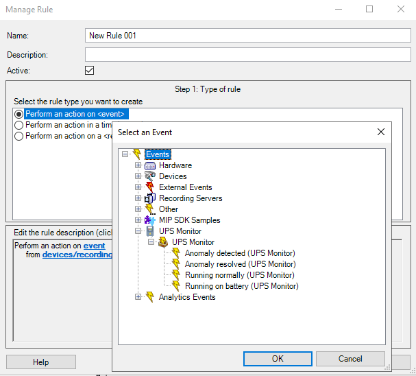
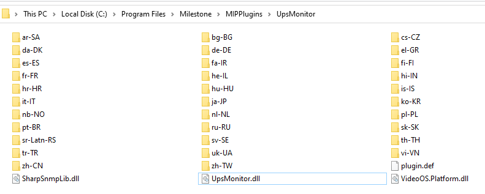

# XP-UpsMonitor

XP-UpsMonitor integrates your UPS systems into the Milestone XProtect VMS device list, allowing you to monitor status and events directly within the Milestone Alarm Manager and Smart Client Maps.

The plugin runs on the Event Server and polls all configured UPS devices using SNMP.
Collected UPS statuses can be visualized in the Smart Client map and used for automated event handling in the Event Server.

## Features
- Parallel SNMP polling for efficient monitoring of multiple UPS devices
- Event generation when UPS switches to battery or restores input power
- Event generation when additional input/output anomalies are detected or resolved
- Simple integration with Milestone Alarm definitions
- Live display of battery backup time for informed, data-driven response prioritization
- Polling interval can be customized anywhere between 30 seconds and 1 hour to suit your needs

## Installation
Output must be copied to host running **Event Server** under **C:\Program Files\Milestone\MIPPlugins\UpsMonitor**.  
Alternatively you can use precompiled binaries available as **[GitHub Releases](https://github.com/lestoilfante/XP-UpsMonitor/releases)**.

Event Server must be restarted in order to load the plugin.

## Configuration
To configure the plugin, use the Milestone Management Client to add your UPS devices.  
The PC running Milestone Management Client must have the plugin installed, as described in the installation instructions above.

Ensure that your UPS supports one of the SNMP MIBs listed below — *the selected OID must be supported by the UPS*.  
Refer to your UPS documentation to confirm compatibility.

- *POWERNET-MIB* 1.3.6.1.4.1.318.1.1.1.4.1.1.0
- *UPS-MIB* 1.3.6.1.2.1.33.1.4.1.0
- *XUPS-MIB* 1.3.6.1.4.1.534.1.4.5.0

*Poll interval* setting is applied system-wide and is not configurable per individual UPS. Changes to this value require an Event Server restart to take effect.

## Requirements
All polling is performed by the Event Server, which must have network and SNMP access to all configured UPS devices. Ensure the Event Server can reach each UPS over the network for proper operation.

## License
[Copyright 2025 lestoilfante](https://github.com/lestoilfante)

GNU Lesser General Public License v2.1

## The "Day 4,361 of your perpetual trial" Note - experimental -
This plugin is released under above mentioned open-source license, and yes, you are entitled to fully use  and modify the plugin as per license details, no strings attached, 100% full functionalities as usual...

Just note that, when running on non free Milestone version, the plugin will show a random *call to support* message as additional row within UPS *Status details* windows on Smart Client and on *UPS Monitor home* within Management Client.

A *kind-of license* will be provided upon sponsorship of any amount that will remove this message.
Feel free to remove the related code or just hack it as you wish, but, hey... I know you know I know you know! Anyway, there's a donate button that you'll probably ignore. Enjoy the plugin 😊

